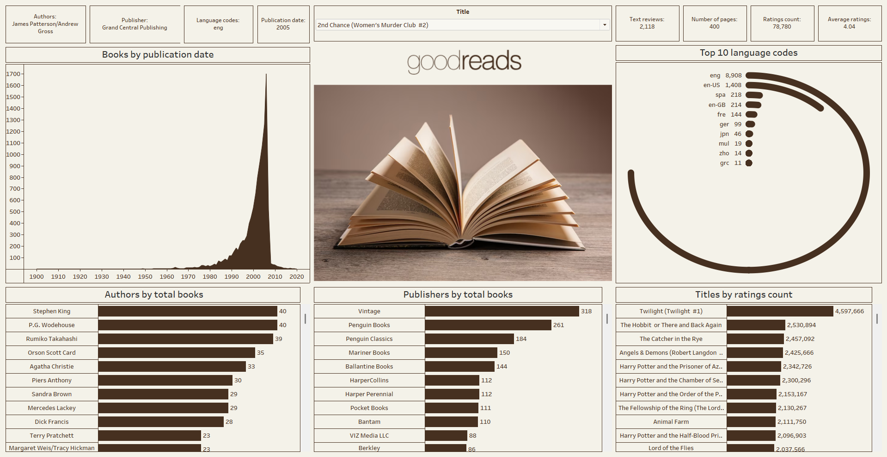

# 📚 Goodreads Books Analysis Dashboard  
### Tableau Data Visualization Project

This project is an interactive Tableau dashboard built using a Goodreads books dataset.  
The dashboard provides insights into authors, publishers, publication trends, languages, ratings, and more.  
It is designed to help users explore large-scale book metadata visually and intuitively.

---

## 🖼 Dashboard Preview

  

---

## 📊 Project Overview

The goal of this project is to analyze and visualize key metrics from a large Goodreads dataset, focusing on:

- Publication year trends  
- Most prolific authors  
- Most active publishers  
- Language code distribution  
- Books with the highest ratings count  
- Book metadata insights (pages, ratings, reviews, etc.)

The dashboard is built to allow **interactive exploration** through filters, charts, and summary cards.

---

## 🔍 Dataset Description

The dataset includes metadata for thousands of books, containing fields such as:

- **Title**
- **Authors**
- **Publisher**
- **Publication date**
- **Number of pages**
- **Language codes**
- **Ratings count**
- **Text reviews count**
- **Average ratings**

You used these fields to build the KPIs and charts displayed in the dashboard.

---

## 📌 What I Did in This Project

### ✔ **1. Cleaned & Prepared the Dataset**
- Removed missing and inconsistent values  
- Standardized date formats  
- Cleaned language codes  
- Combined multi-author fields  
- Prepared measures and dimensions for Tableau  

### ✔ **2. Built Interactive Filters**
- Title  
- Authors  
- Publisher  
- Language codes  
- Publication date  
- Number of pages  
- Ratings count  
- Reviews count  
- Average rating  

### ✔ **3. Designed Multiple Visualizations**
You created meaningful visual components in Tableau, including:

#### 📈 *Books by Publication Date*  
A line area chart showing the number of books published per year (1900–2020).

#### 🧑‍💼 *Authors by Total Books*  
Horizontal bar chart highlighting the most prolific authors  
(e.g., Stephen King, P.G. Wodehouse, Agatha Christie).

#### 🏢 *Publishers by Total Books*  
Bar chart showing top publishers based on book volume  
(e.g., Vintage, Penguin Books, Mariner Books).

#### 🌍 *Top 10 Language Codes*  
Circular bar visualization for the most frequent language codes  
(e.g., eng, en-US, spa).

#### ⭐ *Titles by Ratings Count*  
Ranked list of books with the highest ratings count  
(e.g., Twilight, The Hobbit, The Catcher in the Rye).

#### 📘 *Featured Cover Image Section*  
A central image to visually enhance the storytelling aspect of the dashboard.

---

## 🎛 Interactive KPI Cards

You added several dynamic summary boxes that change based on user filtering:

- Title  
- Authors  
- Publisher  
- Language code  
- Publication date  
- Ratings count  
- Number of pages  
- Text reviews  
- Average rating  

These KPIs help the user quickly understand the currently selected book or category.

---

## 🎨 Dashboard Design Decisions

- Neutral beige/brown color palette for a “bookish” aesthetic  
- Clean layout with balanced spacing  
- Symmetrical grid-style dashboard structure  
- Clear typography for readability  
- Central hero image for strong visual identity  
- Dark brown for charts to maintain stylistic consistency  

---

## 🛠 Tools Used

- **Tableau Public / Tableau Desktop**  
- **Excel / CSV** for dataset storage  
- **Data cleaning** performed manually or with spreadsheet tools  

---

## 📄 Project Objective

The purpose of this project is to:

- Practice Tableau dashboard design  
- Explore exploratory data analysis (EDA) with visual storytelling  
- Transform raw book metadata into actionable insights  
- Develop your portfolio as a Data Analyst / BI Developer  

---

## 📁 Files in This Repository

# 📚 Goodreads Books Analysis Dashboard  
### Tableau Data Visualization Project

This project is an interactive Tableau dashboard built using a Goodreads books dataset.  
The dashboard provides insights into authors, publishers, publication trends, languages, ratings, and more.  
It is designed to help users explore large-scale book metadata visually and intuitively.

---

## 🖼 Dashboard Preview

  

---

## 📊 Project Overview

The goal of this project is to analyze and visualize key metrics from a large Goodreads dataset, focusing on:

- Publication year trends  
- Most prolific authors  
- Most active publishers  
- Language code distribution  
- Books with the highest ratings count  
- Book metadata insights (pages, ratings, reviews, etc.)

The dashboard is built to allow **interactive exploration** through filters, charts, and summary cards.

---

## 🔍 Dataset Description

The dataset includes metadata for thousands of books, containing fields such as:

- **Title**
- **Authors**
- **Publisher**
- **Publication date**
- **Number of pages**
- **Language codes**
- **Ratings count**
- **Text reviews count**
- **Average ratings**

You used these fields to build the KPIs and charts displayed in the dashboard.

---

## 📌 What I Did in This Project

### ✔ **1. Cleaned & Prepared the Dataset**
- Removed missing and inconsistent values  
- Standardized date formats  
- Cleaned language codes  
- Combined multi-author fields  
- Prepared measures and dimensions for Tableau  

### ✔ **2. Built Interactive Filters**
- Title  
- Authors  
- Publisher  
- Language codes  
- Publication date  
- Number of pages  
- Ratings count  
- Reviews count  
- Average rating  

### ✔ **3. Designed Multiple Visualizations**
You created meaningful visual components in Tableau, including:

#### 📈 *Books by Publication Date*  
A line area chart showing the number of books published per year (1900–2020).

#### 🧑‍💼 *Authors by Total Books*  
Horizontal bar chart highlighting the most prolific authors  
(e.g., Stephen King, P.G. Wodehouse, Agatha Christie).

#### 🏢 *Publishers by Total Books*  
Bar chart showing top publishers based on book volume  
(e.g., Vintage, Penguin Books, Mariner Books).

#### 🌍 *Top 10 Language Codes*  
Circular bar visualization for the most frequent language codes  
(e.g., eng, en-US, spa).

#### ⭐ *Titles by Ratings Count*  
Ranked list of books with the highest ratings count  
(e.g., Twilight, The Hobbit, The Catcher in the Rye).

#### 📘 *Featured Cover Image Section*  
A central image to visually enhance the storytelling aspect of the dashboard.

---

## 🎛 Interactive KPI Cards

You added several dynamic summary boxes that change based on user filtering:

- Title  
- Authors  
- Publisher  
- Language code  
- Publication date  
- Ratings count  
- Number of pages  
- Text reviews  
- Average rating  

These KPIs help the user quickly understand the currently selected book or category.

---

## 🎨 Dashboard Design Decisions

- Neutral beige/brown color palette for a “bookish” aesthetic  
- Clean layout with balanced spacing  
- Symmetrical grid-style dashboard structure  
- Clear typography for readability  
- Central hero image for strong visual identity  
- Dark brown for charts to maintain stylistic consistency  

---

## 🛠 Tools Used

- **Tableau Public / Tableau Desktop**  
- **Excel / CSV** for dataset storage  
- **Data cleaning** performed manually or with spreadsheet tools  

---

## 📄 Project Objective

The purpose of this project is to:

- Practice Tableau dashboard design  
- Explore exploratory data analysis (EDA) with visual storytelling  
- Transform raw book metadata into actionable insights  
- Develop your portfolio as a Data Analyst / BI Developer  

---

## 📁 Files in This Repository

